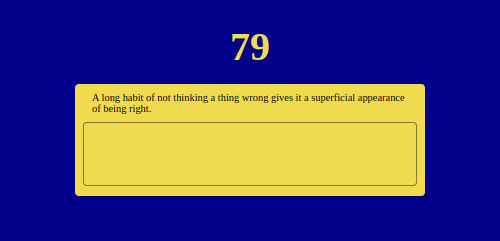
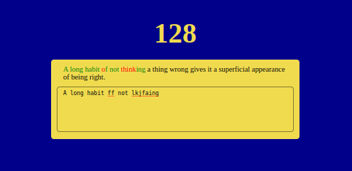

# Mini Proyecto de Typing Game en JavaScript

Este proyecto es una simple aplicación de juego de mecanografía construida con JavaScript puro, HTML y CSS. Los usuarios tienen que escribir una cita generada aleatoriamente y se les proporciona retroalimentación en tiempo real sobre su precisión.

## Código

El código para este proyecto es bastante directo. Se utiliza la Fetch API para solicitar una cita aleatoria de una API.

Una vez que se recibe la cita, se separa en caracteres individuales y se muestra en la página. A medida que el usuario escribe, el juego compara cada caracter ingresado con el correspondiente en la cita. Si coincide, se marca como correcto. Si no coincide, se marca como incorrecto.

## Prueba la App

Para probar la app de tipeo, simplemente ve a la página de demostración alojada en GitHub Pages haciendo click en el siguiente enlace:

* https://pablospata.github.io/typing-game-js/